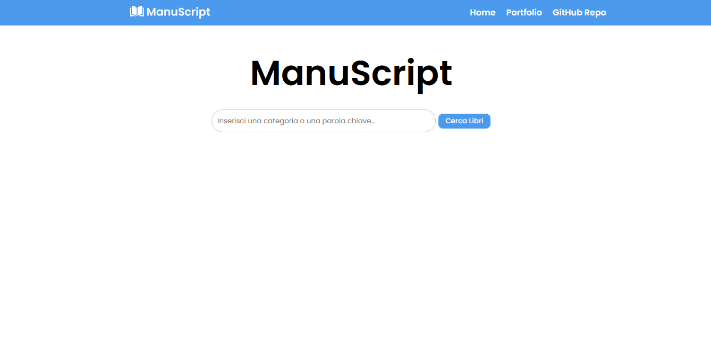

# <h1>ManuScript</h1>

ManuScript è un'applicazione che ha l'obiettivo di incentivare la lettura di libri attraverso il servizio esterno Open Library.  
Puoi accedere all'app <a href="https://manuscript-ff.netlify.app">qui</a>.

## Caratteristiche
- **Ricerca di libri:** Gli utenti attraverso un semplice textbox (Google style) possono cercare libri inserendo una categoria o una parola chiave.
- **Visualizzazione dei risultati:** I libri corrispondenti alla ricerca vengono visualizzati sotto forma di elenco, mostrando titolo e autore.
- **Descrizione del libro:** Gli utenti possono cliccare su un libro per visualizzare una breve descrizione.

(<a href="#readme-top">Torna su</a>)
 

## Come usare
Per utilizzare l'applicazione, basta aprire l'app: <a href="https://manuscript-ff.netlify.app">Manuscript</a>in un browser web.  
È possibile inserire una categoria o una parola chiave nella casella di ricerca e premere il pulsante "Cerca Libri".  
I risultati verranno visualizzati sotto la casella di ricerca.

(<a href="#readme-top">Torna su</a>)

## Homepage

(<a href="#readme-top">Torna su</a>)
 

## Tecnologie utilizzate
- HTML
- CSS
- JavaScript
- Intelligenza Artificiale (ChatGPT, Codeium) per debug

(<a href="#readme-top">Torna su</a>)
 

## Responsive

Il sito è 100% responsive e fruibile sia dal web sia da mobile.  

- Desktop e Monitor > 1280px
- Smartphone piccole dimensioni < 480px
- Smartphone orizzontali e Tablet > 481px < 1280px

(<a href="#readme-top">Torna su</a>)
 

## Contatti

Francesco Fiorentino - [LinkedIn](https://www.linkedin.com/in/francesco-fiorentino-8a854216a/)

(<a href="#readme-top">Torna su</a>)
 

